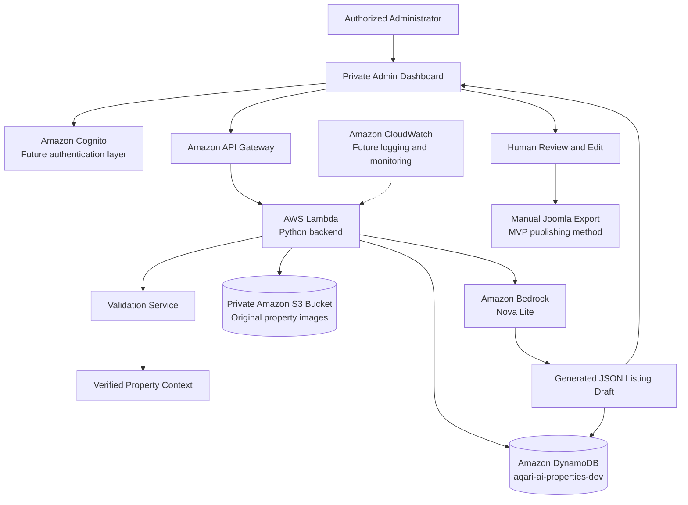

# AQARI AI Architecture

## Purpose

AQARI AI is a controlled real-estate listing assistant for Best Bahrain Properties.

It will help authorized administrators create property listing drafts from verified structured data. The first MVP does not automatically publish to Joomla, Facebook, or Instagram.

## MVP architecture



## Selected Bedrock model

```text
Provider: Amazon
Model: Amazon Nova Lite
Model ID: amazon.nova-lite-v1:0
Region: eu-central-1
```

## Data flow

```text
1. Authorized administrator enters verified property facts.

2. Backend validates fields such as:
   - Property type
   - Transaction type
   - Location
   - Price
   - Bedrooms
   - Bathrooms
   - Area
   - Furnishing
   - Parking
   - Approved features

3. Backend stores the property draft in DynamoDB.

4. Backend builds an AI context using only verified fields.

5. Backend invokes Amazon Bedrock using Amazon Nova Lite.

6. Bedrock returns a controlled JSON content draft:
   - Title
   - Short summary
   - Website description
   - SEO meta description
   - Facebook draft
   - Instagram caption
   - Hashtags
   - Suggested image-order note
   - Claims-used list

7. Backend stores generated output with model and prompt metadata.

8. Authorized administrator reviews, edits, and approves the draft.

9. MVP export remains manual for Joomla publishing.

10. Future phases add controlled Joomla draft integration and
    human-approved social-media publishing.
```

## Trust boundaries

```text
Public GitHub repository
    Contains: source code, tests, documentation, synthetic sample data
    Must not contain: credentials, account IDs, Terraform state,
    Joomla exports, customer data, or real property photos

Private AWS account
    Contains: S3 objects, DynamoDB data, Lambda configuration,
    IAM roles, logs, and future secrets

Amazon Bedrock
    Receives: verified property context only
    Must not receive: internal notes, passwords, tokens, customer PII,
    raw Joomla exports, or unapproved property claims
```

## Security principles

- Original property photos remain private in Amazon S3.
- S3 public access is blocked.
- S3 ACLs are disabled through bucket-owner enforcement.
- DynamoDB is encrypted at rest by default.
- AI-generated content is a draft, not verified property data.
- AI must not invent price, location, property size, amenities,
  contact details, availability, or legal claims.
- Human approval is required before future external publication.
- IAM permissions will follow least privilege.
- Secrets will later use AWS Secrets Manager rather than Git or code.
- CloudWatch will later capture operational logs and metrics.

## Architecture roadmap

| Phase | Capability |
|---|---|
| Phase 1 | Local validation, GitHub repository, CI/CD |
| Phase 2 | Private S3 and DynamoDB resources |
| Phase 3 | Lambda health endpoint and least-privilege IAM role |
| Phase 4 | API Gateway and validated property-draft endpoint |
| Phase 5 | Bedrock listing generation |
| Phase 6 | Cognito protected admin dashboard |
| Phase 7 | Pre-signed S3 photo uploads |
| Phase 8 | Rekognition photo analysis |
| Phase 9 | Step Functions approval workflow |
| Phase 10 | Joomla draft integration |
| Phase 11 | Human-approved Meta social publishing |
| Phase 12 | Controlled property chatbot and RAG search |
